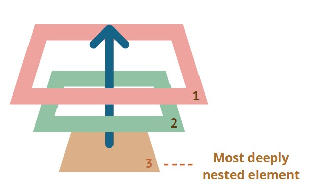

# Eventos HTML

Los eventos HTML son "cosas" que les suceden a los elementos HTML.

Cuando se usa JavaScript en páginas HTML, JavaScript puede "reaccionar" a estos eventos.

## Controladores de eventos de JavaScript

Los controladores de eventos se pueden usar para manejar y verificar la entrada del usuario, las acciones del usuario y las acciones del navegador.

## Burbujeo de eventos en JavaScript

El burbujeo de eventos es un método de propagación de eventos en la API HTML DOM cuando un evento está en un elemento dentro de otro elemento y ambos elementos han registrado un identificador para ese evento. 

Es un proceso que comienza con el elemento que desencadenó el evento y luego asciende a los elementos que lo contienen en la jerarquía. En el burbujeo de eventos, el evento primero es capturado y manejado por el elemento más interno y luego se propaga a los elementos externos.

Cuando ocurre un evento en un elemento, primero ejecuta los controladores en él, luego en su padre y luego en otros ancestros.

## event.target

Un manejador de eventos en un elemento principal siempre puede obtener los detalles sobre dónde sucedió realmente.

El elemento anidado más profundo que provocó el evento se denomina elemento destino, accesible como event.target.

## Detener el burbujeo

Un evento burbujeante va desde el elemento destino directamente hacia arriba. Normalmente va hacia arriba hasta `<html>`, y luego al objeto del documento, y algunos eventos incluso llegan a la ventana, llamando a todos los manejadores de evento en la ruta.

Pero cualquier controlador puede decidir que el evento se ha procesado por completo y detener el burbujeo.

El método para ello es event.stopPropagation().

