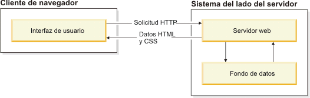
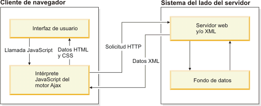

# Ajax

AJAX significa JavaScript asíncrono y XML (Asynchronous JavaScript and XML). Es un conjunto de técnicas de desarrollo web que permiten que las aplicaciones web funcionen de forma asíncrona, procesando cualquier solicitud al servidor en segundo plano.

Ajax permite que un usuario de la aplicación web interactúe con una página web sin la interrupción que implica volver a cargar la página web. La interacción del sitio web ocurre rápidamente sólo con partes de la página de recarga y renovación.

Ajax se compone de las siguientes tecnologías:

- XHTML y CSS para presentar información.
- DOM (Document Object Model - modelo de objetos de documento) para visualizar e interactuar de forma dinámica la información presentada.
- El objeto XMLHttpRequest para manipular los datos de forma asíncrona con el servidor web.
- XML, HTML y XSLT para el intercambio y la manipulación de datos.
- Se visualiza JavaScript para enlazar solicitudes e información de datos.

En una aplicación web tradicional, las solicitudes HTTP, que se inician mediante la interacción del usuario con la interfaz web, se realizan a un servidor web. El servidor web procesa la solicitud y devuelve una página HTML al cliente. Durante el transporte HTTP, el usuario no puede interactuar con la aplicación web.

En una aplicación web Ajax, no se interrumpe el usuario en interacciones con la aplicación web. El motor de Ajax o el intérprete JavaScript permite que el usuario interactúe con la aplicación web independientemente del transporte HTTP procedente del servidor o que tenga el servidor como destino representando la interfaz y gestionando las comunicaciones con el servidor en nombre del usuario.

## Limitaciones de Ajax

Aunque Ajax es una técnica de desarrollo de aplicaciones web que se ha diseñado para que las páginas web sean más receptivas e interactivas con un usuario, Ajax presenta algunas limitaciones a tener en cuenta antes de desarrollar una aplicación basada en Ajax. Las limitaciones siguientes representan algunas de las desventajas principales:

- Soporte de navegador - No todos los navegadores admiten JavaScript o el objeto XMLHttpRequest.
- Seguridad y privacidad de usuario - No se resuelven todos los puntos de vista. Es necesario tener en cuenta los problemas relacionados con la seguridad y la privacidad de usuario a la hora de desarrollar una aplicación Ajax.
- Marcador y navegación - Puesto que Ajax se utiliza para cargar bits de contenido de forma asíncrona en una página existente, es posible que parte de la información de la página no corresponda a una página recién cargada. Puede que el historial del navegador y los marcadores no se comporten de forma correcta porque el URL no se ha modificado aunque ciertas partes de la página se hayan cambiado.
