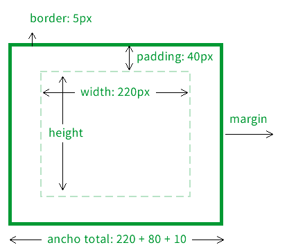

# Modelo de caja

El modelo de caja es la manera en que se representan todos los elementos html en una página. Cada elemento genera una caja, el comportamiento de esa caja depende de su clasificación: si es de línea o de bloque.

Las cajas de una página se crean automáticamente. Cada vez que se inserta una etiqueta HTML, se crea una nueva caja rectangular que encierra los contenidos de ese elemento.

A todas las cajas se les puede aplicar las siguientes propiedades:

1. Width (Ancho).
2. Height (Altura).
3. Padding (Relleno).
4. Margin (Margen).
5. Border (Orilla).
6. Background (Fondo).

Lo particular de este concepto es que por defecto el width se refiere al ancho del contenido de un elemento (no al ancho total, de borde a borde).

Si una caja tiene una visualizacion de tipo bloque, se comportará de las siguientes maneras:

- La caja se dividirá en una nueva línea.
- La caja se extenderá en la dirección en línea para llenar el espacio disponible en su contenedor. En la mayoría de los casos esto significa que la caja se volverá tan ancha como su contenedor, llenando el 100% del espacio disponible.
- Se respetan las propiedades de ancho y alto.
- El relleno, el margen y el borde harán que otros elementos se alejen del cuadro.

Algunos elementos HTML, como **h1** y **p**, usan bloque como tipo de visualización externa de forma predeterminada.

Si una caja tiene un tipo de visualización de línea, entonces:

- La caja no se dividirá en una nueva línea.
- Las propiedades de ancho y alto no se aplicarán.
- Se aplicarán relleno vertical, márgenes y bordes, pero no harán que otros cuadros en línea se alejen del cuadro.
- Se aplicarán rellenos horizontales, márgenes y bordes y harán que otros cuadros en línea se alejen del cuadro.

Algunos elementos HTML, como **a**, **span**, **em** y **strong** usan en línea como su tipo de visualización externa de forma predeterminada.

## Medidas Flexibles

Existen propiedades que definen el valor máximo o mínimo, éstas permiten mayor flexibilidad y se usan especialmente en los sitios responsivos:

- **Max-width**: ancho máximo. El elemento no puede ser más ancho que el valor especificado pero sí puede achicarse.

- **Min-width**: ancho mínimo.  El elemento no puede ser más angosto que el valor especificado pero sí puede agrandarse.

- **Max-height**: alto máximo. El elemento no puede ser más alto que el valor especificado pero sí puede achicarse.

- **Min-height**: alto mínimo. El elemento no puede ser más bajo que el valor especificado pero sí puede agrandarse.
  